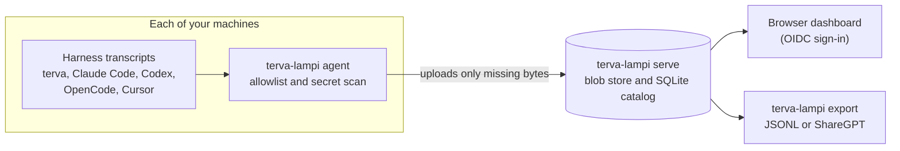

# lampi

**A self-hosted lake for your AI agent transcripts.** `terva-lampi`
copies the session files that terva, Claude Code, Codex, OpenCode, and
Cursor write on each of your machines to one lake that you host. From
there you browse and search them in a dashboard, or export them.

lampi is Finnish for a pond, a small lake. One static Go binary is both
the lake (`terva-lampi serve`) and the agent on each machine
(`terva-lampi agent`).

## How it works



- **The agent** watches each harness's session directory. It uploads a
  transcript only when its project is on your allowlist, and holds back
  any file in which it finds a token or private key.
- **The lake** stores raw bytes by their sha256, so the same transcript
  uploaded from two machines is stored once, with a record of both. A
  growing transcript uploads only its new tail.
- **You** read the lake in a browser dashboard, or export it as
  normalized JSONL or a ShareGPT training set.

Agents dial the lake. Nothing dials into your laptop.

## Supported harnesses

| Harness | What is read |
|---------|--------------|
| terva | `$TERVA_HOME/sessions`, with its `raati/` and `tasks/` sidecars |
| Claude Code | `~/.claude/projects/**/*.jsonl` |
| Codex CLI | `~/.codex/sessions/**/rollout-*.jsonl` |
| OpenCode | `opencode export` JSON, or its database |
| Cursor IDE and Cursor CLI | Read-only snapshots of their SQLite stores |

Each path moves with the harness's own environment variable, and you
can turn a harness off. See [Harnesses](docs/harnesses.md).

## Quickstart

You need Go 1.27. From a checkout:

```bash
make build
./bin/terva-lampi serve          # a private lake on 127.0.0.1:8787
```

In a second terminal, see what the agent finds, then allow one project
and upload it:

```bash
./bin/terva-lampi agent discover
mkdir -p ~/.config/terva-lampi
cat > ~/.config/terva-lampi/config.json <<'EOF'
{"projects": {"allow": [{"cwd_prefix": "/home/you/src/my-project"}]}}
EOF
./bin/terva-lampi sync
./bin/terva-lampi status
```

Every project is refused until an allow rule admits it, and `sync`
prints the `cwd` of each refused session so you can copy it into a
rule. `./bin/terva-lampi agent` keeps watching and uploads as sessions
grow.

[Getting started](docs/getting-started.md) walks through the same steps
with the output you should see. If this machine already runs a lake or
an agent, use the [development recipes](docs/development.md#develop-on-a-machine-that-runs-lampi)
so you do not write to the live one.

## Add another machine

A second machine needs a lake it can reach. The quickstart lake listens
on loopback with no token, so stop it with Ctrl-C first. Put the lake
host behind TLS ([VPS bring-up](docs/vps-bringup.md) covers the proxy).
Then start the lake again with an operator token, and record the URL
agents use:

```bash
terva-lampi login --token-file ./tokens/operator.token
terva-lampi serve --token-file ./tokens &
terva-lampi serve identity set-url https://lake.example
```

Then, on the lake host, mint a one-time code. Move it the way you would
move a password:

```bash
terva-lampi serve register --name laptop > laptop.code
```

On the laptop, redeem it. `register` checks the lake's key, asks you to
confirm its fingerprint, and installs the agent as a user service:

```bash
terva-lampi register --code-file laptop.code --install-service
```

[Registration and lakes](docs/registration-and-lakes.md) covers the
lake's one-time setup, sending sessions to more than one lake, and the
manual token fallback. To host the lake on a server with TLS and
backups, follow [VPS bring-up](docs/vps-bringup.md).

## Browser dashboard

The optional read-only dashboard shows counts, harnesses, normalization
status, sessions, provenance, and conflicts. It reads normalized
transcripts, searches them by literal text or event kind, links to
single events, and copies a span of events as text.

Sign-in is OIDC with a group mapping. Browser sessions and device
tokens cannot authorize each other's routes, and without a web config
the dashboard is off. [Serving the dashboard](docs/web-dashboard.md)
covers IdP registration, the server config, TLS, and sessions. Bulk
export and ingestion charts are planned for later releases.

## Documentation

The [documentation index](docs/README.md) groups every page by task.

| If you want to | Read |
|----------------|------|
| Try lampi on one machine | [Getting started](docs/getting-started.md) |
| Decide which projects leave the machine | [Allowlist and redaction](docs/allowlist-and-redaction.md) |
| Add machines, or report to several lakes | [Registration and lakes](docs/registration-and-lakes.md) |
| Host a lake | [VPS bring-up](docs/vps-bringup.md) and [deploy/README.md](deploy/README.md) |
| Turn on the dashboard | [Serving the dashboard](docs/web-dashboard.md) |
| Look up a command or setting | [Command reference](docs/cli.md) |
| Understand the design | [Architecture](docs/architecture.md) and [Capture protocol 1](docs/protocol.md) |
| Work on lampi | [Developing lampi](docs/development.md) and [Pull requests and reviews](docs/pr-reviews.md) |

## How lampi relates to terva

terva's fleet is a live control plane: members dial a hub so one
browser can drive sessions. The lake stores bytes after the fact. The
protocols stay separate. `terva-ext-session-search` is local recall for
one project on one machine. The lake is the central copy across all of
them.

The command is `terva-lampi`, not `lampi`, because a bare `lampi`
already names an unrelated LAMP installer.
[Why the command is terva-lampi](docs/naming.md) has the details and
how to add a `lampi` shortcut safely.

## Status

lampi works end to end today for all six harnesses against a local or
hosted lake. It has registration, many lakes, the ruleset v2 scan,
normalized events, ShareGPT export, backup and restore, and the OIDC
dashboard. There is no tagged release yet, so build from a checkout.
[Architecture](docs/architecture.md) lists what is built and what is
not. Open work is in [.tickets/](.tickets/epics.md).

## License

MIT. See [LICENSE](LICENSE).
