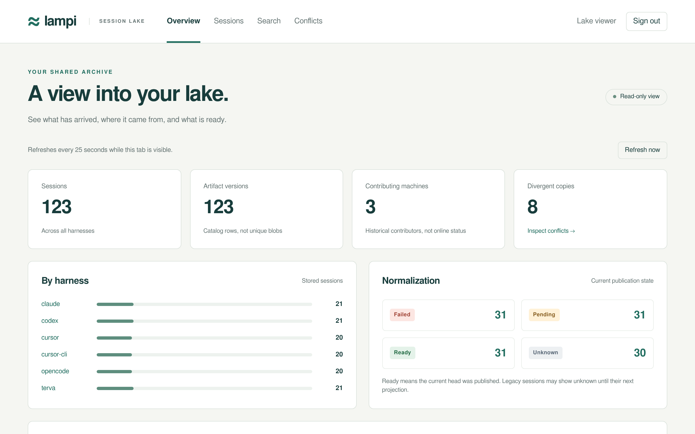
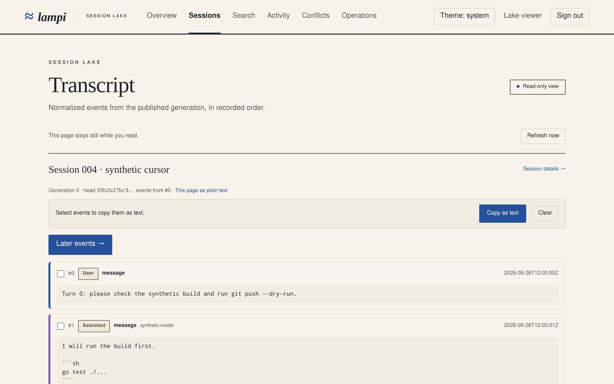

# Serving the OIDC dashboard

Read this to turn on the browser dashboard for a lake you run. The routes it
serves are in [web-api.md](web-api.md). Back to the
[documentation index](README.md).

The dashboard shows lake totals, a harness breakdown, normalization status,
recent and filtered sessions, artifact metadata, provenance, and divergent
copies. It reads normalized transcripts, searches them, and copies a span of
events as text, and charts how often session heads changed. It is read-only.
Downloads remain a future release in [web-ui-plan.md](web-ui-plan.md).





The screenshots come from the synthetic fixture, not a real lake. To regenerate
them, follow [README screenshots](../e2e/README.md#readme-screenshots). The
script needs the path to a Playwright install.

## Register the application

Use your identity provider's OIDC application registration. Terva's sibling
implementation was built against Authentik; Lampi uses discovery and is not
vendor-specific. Operator-supplied values are the public lake origin, issuer URL,
client ID, client secret file if using a confidential client, and viewer group.
The repository does not name or provision a live deployment.

1. Register Authorization Code with S256 PKCE. A confidential client uses a
   secret; a public client may omit `client_secret_file` if the provider permits it.
2. Register the exact callback `https://lake.example/auth/oidc/callback`, replacing
   the origin with the deployed origin. No wildcard redirect is needed.
3. Supply `openid`, `profile`, `email`, and the scope that supplies group membership
   in the **ID token**. The default extra scopes are profile/email/groups; customize
   `scopes` when your provider uses different scopes. `openid` is always included.
4. Map the actual group claim and exact group names. A successful IdP login grants
   no access unless a configured group maps to `viewer` or `operator`. A viewer
   reads metadata for the whole lake; this release has no per-project viewer
   isolation. An `operator` is also a viewer and can manage registration codes,
   which adds machines to the lake. Map it to a small group. Operator routes
   answer 404 to a viewer.
5. For operator actions that add access, the dashboard asks the provider to sign
   the user in again with OIDC `max_age` and requires an `auth_time` from the
   last 10 minutes. The provider must return `auth_time` in the ID token when
   `max_age` is sent, as OIDC Core requires; one that does not cannot be used for
   those actions.

Use HTTPS for the issuer and discovered authorization/token/JWKS endpoints. A
private CA belongs in the service's system trust store. There is no TLS or issuer
verification bypass. The callback is derived from configuration, never request
Host or forwarded headers. Avoid putting browser sign-in middleware in front of
`/v1`: agents must continue to use their device tokens.

## Configure the service

Start from [deploy/web-config.json.example](../deploy/web-config.json.example).
All values in that example are placeholders. `base_url` is an origin only, with
no trailing slash, path, query or fragment. The server config is independent of
an agent's `config.json`; serve never loads the agent's allowlist or credentials.
Unknown JSON fields, unknown roles and an empty role map fail startup.

Store a confidential client secret in an absolute-path, regular file readable
only by its owner (0600 on Unix), owned by the service user. It must contain only
the secret, optionally followed by a newline, and be at most 4096 bytes. Do not
put it in JSON, process arguments, shell history or source control. The example
uses `/etc/terva-lampi/oidc-client-secret`; the service needs read access, not
write access. A public client omits that field entirely. Protect the web config
as operator configuration too; it grants access through its group map.

With the paths from the existing deployment examples:

```sh
terva-lampi serve --addr 127.0.0.1:8787 \
  --data /var/lib/terva-lampi \
  --token-file /var/lib/terva-lampi/tokens \
  --web-config /etc/terva-lampi/web.json
```

The example systemd unit accepts `LAMPI_SERVE_WEB_CONFIG` in
`/etc/terva-lampi/serve.env`. Set it to the absolute web config path and restart
the service. It defaults to empty, leaving web disabled. This is systemd argument
substitution, not a new environment variable that the Go process reads itself.
The existing sandbox permits reading `/etc/terva-lampi`; `ProtectHome` still
prevents reading files placed in a user's home.

**Web enabled requires a nonempty device-token set even on loopback.** Otherwise
publishing a loopback backend through a proxy could open `/v1` ingestion. A
browser cookie cannot authorize `/v1`, and a device token cannot authorize the
browser API. The existing public `/healthz` remains a data-free process probe.
Omitting `--web-config`, or setting it empty, disables the page/auth/browser API
routes without changing existing agent behavior.

Web configuration changes, including group mappings and client secrets, require
restart. SIGHUP reloads device tokens only. Invalid local web configuration fails
before listening. Discovery is lazy: an unavailable IdP returns a sign-in error,
while ingestion and existing browser sessions continue. A later login retries.
Provider requests have ten-second budgets and at most eight concurrent operations.

## TLS proxy and sessions

Keep the Go listener on loopback, behind the HTTPS proxy in
[vps-bringup.md](vps-bringup.md). Proxy all paths to that listener, preserve cookies,
and do not cache authenticated responses or strip their `no-store` header. Keep
the existing upload body limits, streaming and timeouts. No CORS configuration is
needed. Do not log auth callback query strings, Authorization or Cookie headers at
the proxy. For nginx, use `$uri` rather than `$request` or `$request_uri` in an
access-log format; those latter variables contain the callback authorization code.
The application's access log already excludes query strings and headers carrying
credentials. Auth failures add fixed reason messages, not provider error bodies.

Traefik's default access-log format can include the query string. Before enabling
OIDC, either configure a format that excludes sensitive request fields or disable
access logging for the Lampi router. On Traefik 3.7.13, the following router option
was verified with an isolated instance: a synthetic query on the Lampi route was
absent from the log while an unrelated control request was still logged.

```yaml
http:
  routers:
    lampi:
      # Keep the existing rule, entryPoints and service.
      observability:
        accessLogs: false
```

This disables proxy access logs for that router, not Lampi's credential-safe
application logs. Verify support on the installed Traefik version and probe with
a harmless query marker before the first real login. Never use an actual callback
code or print existing credential-bearing log lines as test evidence.

Production cookies are HttpOnly, Secure, SameSite=Lax, host-only and use a
`__Host-lampi_` prefix. A session expires after one hour idle or twelve hours total.
Polling counts as activity, but never extends the absolute expiry. Group membership
is captured at login; IdP membership changes take effect at next login or hard
expiry. Restart revokes all sessions. Sign out revokes the local session using
CSRF-protected POST; it does not sign the user out of their identity provider.
The provider may sign them in again without another password prompt.

A plain HTTP browser origin is accepted only on loopback for development, using
separate unprefixed development cookies. This exception does not permit a plaintext
issuer. Tests use a fake HTTPS IdP and an injected trust pool, not a production
configuration bypass.

## What the dashboard means

- Artifact versions count catalog rows, not unique blobs or disk usage.
- Contributing machines have uploaded data; the count is not online status.
- Last head update is not a history of every upload or a throughput measurement.
- Pending includes queued, running and retrying normalization. Failed means a
  recorded terminal failure. Ready requires publication of the current generation
  and head. Unknown includes legacy rows not verified by a new publication.
- To clear unknown and failed sessions, run `terva-lampi serve normalize --stale
  --failed` on the lake host (as the service user, with `--data`), then send
  serve SIGHUP (`systemctl kill -s HUP terva-lampi-serve`). The overview's
  counts move from pending to ready or failed as the jobs finish. `--dry-run`
  lists the sessions first, and `--session UID` takes one.
- Metadata lists use bounded live cursor pages. Ingestion may move a session to
  an earlier page; refresh to start over. Large labels/paths are display previews.
  The [browser API contract](web-api.md) describes exact limits.

Overview and the first session page refresh every 25 seconds while visible.
Other pages stay still. Refresh pauses on failures, expired login, hidden tabs or
keyboard focus inside the updated table. Manual refresh retries. Forms, navigation
and tables also work without JavaScript.

A session whose normalization is ready links to its transcript at
`/sessions/{uid}/transcript`. The page shows 100 normalized events at a time in
recorded order, as plain text, with earlier and later pages. Every event has a
link that names its generation and position; opening one shows the page around
it, marks it and moves keyboard focus to it. A link never shows whatever now
sits at that position in a different generation. Instead it says what happened:
a newer generation replaced it, normalization is running or failed, the position
is past the end, or the session was purged. Each case links back to the current
view. Long text, large `extra`
objects and encrypted values are reduced as the
[browser API contract](web-api.md#transcript-events) describes.

To reuse part of a transcript, tick the events you want, or tick one and
shift-click another to take the run between them, and press Copy as text. The
clipboard gets plain text with a header that names the session and links back
to it. Open as text shows the same text as a page. Without JavaScript, each
transcript page links its own plain text.

`/search` finds literal text in every indexed transcript: `git push --force`,
a path or an error message matches as written, ignoring case. Filters narrow by
harness, project and recorded date. Each result names its session and event and
links straight to that event in the transcript. The page states how many ready
sessions the index covers. Raw blobs and export are absent.

### Theme

The dashboard follows the system's light or dark setting. The theme button
in the header cycles through system, light and dark. The choice is kept in
the browser's local storage, not on the lake, and is applied before the
page paints. Without scripts the button is hidden and the system setting
applies. Both themes keep body text at WCAG AA contrast, and a test checks
this against the colour tokens in `lake.css`.

## Registration codes

An operator sees a Registrations link. `/admin/registrations` lists every
registration code by state (pending, used, expired, revoked), with who minted
it and, for a used code, the device it made. A viewer gets 404 there, as on
every operator route. Listing writes the expiries since the last look to
`audit.jsonl`, as `serve register --list` does.

To add a machine, give it a device name, a profile and an expiry, and press
Mint code. Minting needs a sign-in at the IdP in the last 10 minutes; without
one the form is replaced by Sign in again to mint, which goes through the IdP
and comes back. The mint is the same one `serve register` does on the lake
host: the lake checks its public URL reaches it, stores only the code's hash,
and writes the mint to `audit.jsonl` with the operator as actor before it shows
the code.

The code is shown once, on the page that answers the mint, and not again.
Reloading that page does not mint a second code or show the first again: it
names the code the form made, so it can be cancelled if it was not copied. A
mint form is good for an hour, and until serve restarts; after that it is out
of date and mints nothing.
Copy one of two things:

- **The install line.** It installs terva-lampi and registers the machine with
  the code. It fetches `install.sh` from the release tag the lake was built
  from and installs that release, so the machine runs the lake's version, and
  passes the lake's key fingerprint for the machine to check. A lake built from
  no release tag gets `install.sh` from `main` and the latest release, and the
  page says so. The line begins with a space, so shells that skip such lines
  leave it out of history. The code is in the line: that is why the expiry
  starts at one hour.
- **The code alone**, for `terva-lampi register` on a machine that already has
  the binary. Paste it at the prompt or pipe it on stdin, never as a command
  argument.

Cancel stops a pending code. A used code made a device, and
`serve devices revoke` on the lake host stops that. The dashboard mints at most
5 codes at once and one more every 12 seconds. The
[browser API](web-api.md#registration-codes) has the same actions as JSON.

## Activity

`/activity` charts the updates the lake accepted, per UTC hour or day. The
range is the last 24 hours or 7 days by the hour, or the last 7, 30 or 90 days
by the day. A harness filter narrows it. Two charts sit side by side, each with
a hover label on every bar, and "Show as a table" lists the same numbers. The
page refreshes every 25 seconds while it is visible.

- **Accepted head updates** counts each time a session head changed: a new
  session, a transcript that grew, or a Cursor or OpenCode export rewritten.
  An agent retrying an upload, a stale upload, a second machine uploading bytes
  the lake already has, and a divergent copy change no head and are not counted.
- **Net logical head-size change** adds up the new head's size minus the old
  one's. A rewrite that shrank a session is negative and drawn below the axis.
  This is not network traffic, and it is not disk growth: the CAS keeps every
  blob it stored, and one blob can serve many sessions.
- **Recording starts at the upgrade.** The catalog records updates from the
  moment it reaches schema 8, and the page shows that time. Earlier activity
  is not rebuilt from session timestamps, which only keep the latest head.
  Buckets before recording began are hatched and read "not measured". They are
  not zero. The bucket in which recording began is marked partial in the table.
- **Purge and restore change history.** `serve purge` deletes a session's
  updates, so past buckets lose them. Restoring a backup rewinds the history to
  the moment of the backup. Agents that upload again afterwards are counted
  when the lake accepts them, not when they first uploaded.

The [browser API contract](web-api.md#activity) gives the JSON form, with the
range limits: at most 14 days by the hour and 90 days by the day.

## Operations

`/operations` answers two questions: how full the lake is, and whether it
keeps up. It does not refresh on its own, because its storage figures change
hourly.

- **Where the space goes** lists each part of the lake directory: its disk
  use, its share of the whole, its file count, and how much it changed over
  the chosen range.
  - Stored blobs, the catalog and the audit log are the lake's record, and
    `serve backup` copies them.
  - Normalized events, parquet and the search index are derived from that
    record and can be rebuilt.
  - Uploads in progress holds partial uploads and temporary files. Start-up
    sweeps any that are a day old.
- **Filesystem free** is the space left on the filesystem that holds the lake,
  whatever else shares that filesystem.
- **Deduplication** is the logical bytes every artifact row names, divided by
  the bytes of each distinct blob counted once.
- **Growth charts** show the lake directory's disk use and the filesystem's
  free space: hourly over the last 7 days, or daily over 30 or 90. Hours or
  days with no sample are hatched and read "not measured".
- **Machines** lists each device with its last contact and its last new data.
  - A machine that is running but has nothing new to upload still makes
    contact.
  - A machine that has stopped syncing goes idle after a day and quiet after
    a week.
  - Last contact is the device's newest request. After serve restarts, it
    starts from the device's newest agent report, which the catalog keeps,
    until the device makes contact again.
  - A machine that uploaded before devices were recorded shows as an
    unregistered machine.

Serve takes the first sample when it starts, and then one every hour. Samples
from the last 14 days are all kept; older ones are thinned to one per day.

The [browser API contract](web-api.md#operations) gives the JSON form.

## Search index

With web configuration, serve keeps a full-text index of normalized event text
in `search.db` in the data directory. It is derived from the published
normalized JSONL and holds nothing else. A serve without web configuration
neither builds nor updates it.

- **Catch-up.** The index follows the catalog. Each finished normalization
  wakes it, and it also checks every five minutes and at every start, so a crash
  or restart loses no work. A new generation becomes searchable in one step, and
  the old one stays searchable until then. A pending, failed or purged session
  drops out of results at once, even before the index removes its rows.
- **Coverage.** Search results report how many ready sessions are indexed, how
  many are behind, and how many the index could not read. A session it could not
  read is retried when a new generation is published.
- **Size.** The trigram index takes roughly two to three times the indexed text
  on disk. Only the first 256 KiB of one event's text is indexed; the full text
  stays in the transcript. A session is re-indexed whole at each new
  generation, and the rows it replaces stay in the full-text segments until
  they merge. After each pass that wrote rows the index merges a bounded amount
  and returns the freed pages to the filesystem, which keeps the file near its
  live size rather than letting it grow to several times that.
- **Rebuild.** Stop serve, delete `search.db`, `search.db-wal` and
  `search.db-shm`, and start serve. The index is rebuilt in the background while
  the lake keeps serving. A file with an unknown schema version is rebuilt the
  same way on its own, which is what the first start of a release with a new
  index schema does.
- **Backup and purge.** `serve backup` does not copy the index; a restored lake
  rebuilds it. `serve purge` removes the session's index rows first.

## Validation, backup and rollout

The catalog upgrade adds published-generation/head markers and indexed numeric
head-update timestamps. Schema 8 adds the head-update history the Activity page
reads, and it records from the upgrade on. Take the normal lake backup before upgrading a deployed
lake. An older binary refuses the newer schema; rollback requires a compatible
binary or an appropriate pre-upgrade backup, not editing `user_version`.

`serve backup` retains its existing scope: catalog, blobs and device-token copy.
Web configuration and the external OIDC secret file need your separate protected
configuration backup. In-memory browser sessions never enter a backup. Restore
and reconfigure the service, then sign in again.

Run local gates with Go 1.27 (`mise exec --` where Go is managed by mise):

```sh
make ci
go test -race ./...
go test ./internal/catalog -run TestDashboard20K -count=1 -v
```

[e2e/README.md](../e2e/README.md#browser-dashboard-smoke) documents the automated
Chromium smoke. It covers login, denied access, pagination, filters, metadata,
conflicts, activity charts, refresh failures/recovery, mobile/keyboard use, no-JS,
empty lake and logout against temporary synthetic lakes. No live credentials are needed.

Before a real rollout, provide the actual origin/issuer/client/group/secret path,
verify the IdP callback and claim mapping, and apply the existing VPS go-live gates.
The dashboard release does not certify the separate restore, canary-secret, crash
or throttled-upload tickets. Building or testing this feature does not deploy it.
